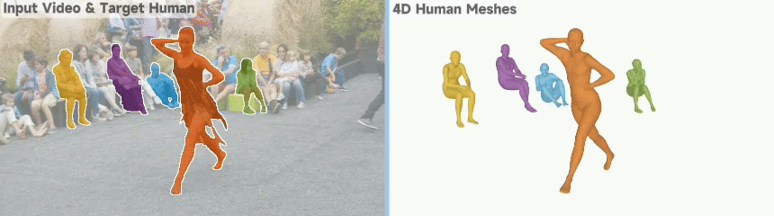
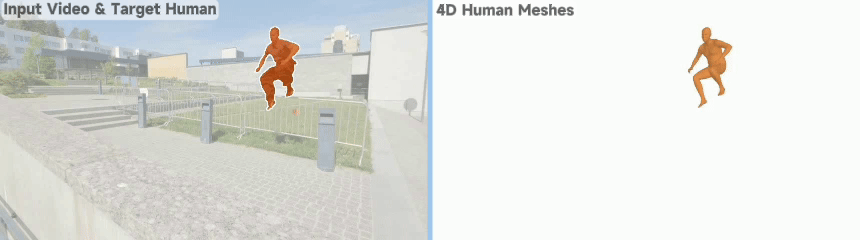

<!-- <h1 align="center">🏂 SAM-Body4D</h1> -->

# 🏂 SAM-Body4D

[**Mingqi Gao**](https://mingqigao.com), [**Yunqi Miao**](https://yoqim.github.io/), [**Jungong Han**](https://jungonghan.github.io/)

**SAM-Body4D** is a **training-free** method for **temporally consistent** and **robust** 4D human mesh recovery from videos.
By leveraging **pixel-level human continuity** from promptable video segmentation **together with occlusion recovery**, it reliably preserves identity and full-body geometry in challenging in-the-wild scenes.

[ 📄 [`Paper`](https://arxiv.org/pdf/2512.08406)] [ 🌐 [`Project Page`](https://mingqigao.com/projects/sam-body4d/index.html)] [ 📝 [`BibTeX`](#-citation)]


### ✨ Key Features

- **Temporally consistent human meshes across the entire video**
<div align=center>

</div>

- **Robust multi-human recovery under heavy occlusions**
<div align=center>

</div>

- **Robust 4D reconstruction under camera motion**
<div align=center>

</div>

<!-- Training-Free 4D Human Mesh Recovery from Videos, based on [SAM-3](https://github.com/facebookresearch/sam3), [Diffusion-VAS](https://github.com/Kaihua-Chen/diffusion-vas), and [SAM-3D-Body](https://github.com/facebookresearch/sam-3d-body). -->

## 🕹️ Gradio Demo

https://github.com/user-attachments/assets/07e49405-e471-40a0-b491-593d97a95465


## 📊 Resource & Profiling Summary

For detailed GPU/CPU resource usage, peak memory statistics, and runtime profiling, please refer to:

👉 **[resources.md](assets/doc/resources.md)**  


## 🖥️ Installation

#### 1. Create and Activate Environment
```
conda create -n body4d python=3.12 -y
conda activate body4d
```
#### 2. Install PyTorch (choose the version that matches your CUDA), Detectron, and SAM3
```
pip install torch==2.7.1 torchvision==0.22.1 torchaudio==2.7.1 --index-url https://download.pytorch.org/whl/cu118
pip install 'git+https://github.com/facebookresearch/detectron2.git@a1ce2f9' --no-build-isolation --no-deps
pip install -e models/sam3
```
If you are using a different CUDA version, please select the matching PyTorch build from the official download page:
https://pytorch.org/get-started/previous-versions/

#### 3. Install Dependencies
```
pip install -e .
```


## 🚀 Run the Demo

#### 1. Setup checkpoints & config (recommended)

We provide an automated setup script that:
- generates `configs/body4d.yaml` from a release template,
- downloads all required checkpoints (existing files will be skipped).

Some checkpoints (**[SAM 3](https://huggingface.co/facebook/sam3)** and **[SAM 3D Body](https://huggingface.co/facebook/sam-3d-body-dinov3)**) require prior access approval on Hugging Face.
Before running the setup script, please make sure you have **accepted access**
on their Hugging Face pages.

If you plan to use these checkpoints, login once:
```bash
huggingface-cli login
```
Then run the setup script:
```bash
python scripts/setup.py --ckpt-root /path/to/checkpoints
```
#### 2. Run the SAM3 UI
```bash
python app.py
```
The web UI now focuses on interactive SAM3 prompting, mask generation, and cache export.
After loading a video:
- add or refine targets in the UI
- click `Mask Generation`

`Mask Generation` now auto-exports the SAM3 cache, so no extra export button is required.

The exported cache is written under `<runtime.output_dir>/sam3_cache/<sample_id>/` and includes:
- `images/*.jpg`
- `masks/*.png`
- `meta.json`
- `prompts.json`
- `frame_metrics.json`
- `events.json`

`app.py` no longer runs 4D directly. This keeps the interactive SAM3 stage traceable and lets 4D run later in batch or on a different machine.

## Recommended Commands

If you mainly work from the terminal, these are the most practical entry points.
All four flows are also wrapped by the repository-root `run.sh` helper, so you can use either the direct Python command or the wrapper form.

#### 1. Debug human detector outputs before a full run

Use `scripts/debug_human_detection.py` to draw detector boxes on an image or video:

```bash
python scripts/debug_human_detection.py \
  --input_path data/demo.mp4 \
  --detector_backend yolo \
  --output_path outputs/debug/demo_detected.mp4
```

Wrapper form:

```bash
./run.sh detect-debug \
  --input_path data/demo.mp4 \
  --detector_backend yolo \
  --output_path outputs/debug/demo_detected.mp4
```

#### 2. Run the refined offline pipeline on one sample

```bash
python scripts/offline_app_refined.py \
  --input_video data/demo.mp4 \
  --config configs/body4d_refined.yaml \
  --max_targets 2
```

Low-memory example:

```bash
python scripts/offline_app_refined.py \
  --input_video data/demo.mp4 \
  --config configs/body4d_refined_low_memory.yaml \
  --max_targets 2
```

Wrapper form:

```bash
./run.sh offline-refined \
  --input_video data/demo.mp4 \
  --config configs/body4d_refined_low_memory.yaml \
  --max_targets 2
```

#### 3. Run the refined batch pipeline

```bash
python scripts/offline_batch_refined.py \
  --input_root /path/to/batch_videos \
  --output_dir /path/to/outputs_refined \
  --config configs/body4d_refined_low_memory.yaml \
  --skip_existing \
  --continue_on_error
```

Wrapper form:

```bash
./run.sh offline-refined-batch \
  --input_root /path/to/batch_videos \
  --output_dir /path/to/outputs_refined \
  --config configs/body4d_refined_low_memory.yaml \
  --skip_existing \
  --continue_on_error
```

#### 4. Run offline 4D from exported SAM3 cache

Run one sample:

```bash
python scripts/run_4d_from_cache.py --cache_dir /path/to/sam3_cache/sample_id
```

Run every sample under one cache root:

```bash
python scripts/run_4d_from_cache.py \
  --cache_root /path/to/sam3_cache \
  --output_root /path/to/outputs_4d \
  --overwrite
```

Wrapper form:

```bash
./run.sh cache-4d \
  --cache_root /path/to/sam3_cache \
  --output_root /path/to/outputs_4d \
  --overwrite
```

#### 3. Run 4D offline from an exported cache
```bash
python scripts/run_4d_from_cache.py --cache_dir <path/to/sam3_cache/sample_id>
```

Or run every exported sample under a cache root:
```bash
python scripts/run_4d_from_cache.py --cache_root <path/to/sam3_cache>
```

Useful options:
- `--output_root <path>` writes results under a custom root instead of the default config-derived location
- `--config <path>` overrides the config path stored in `meta.json`
- `--overwrite` replaces an existing `outputs_4d/<sample_id>/` directory

By default, the offline 4D runner writes outputs to `<runtime.output_dir>/outputs_4d/<sample_id>/`.
That output tree now includes:
- `mesh_4d_individual/<track_id>/*.ply`
- `focal_4d_individual/<track_id>/*.json`
- `openpose_json/<track_id>/<frame>_keypoints.json`
- `smpl_json/<track_id>/<frame>.json`

#### Manual checkpoint setup (optional)

If you prefer to download checkpoints manually ([SAM 3](https://huggingface.co/facebook/sam3), [SAM 3D Body](https://huggingface.co/facebook/sam-3d-body-dinov3), [MoGe-2](https://huggingface.co/Ruicheng/moge-2-vitl-normal), [Diffusion-VAS](https://github.com/Kaihua-Chen/diffusion-vas?tab=readme-ov-file#download-checkpoints), [Depth-Anything V2](https://huggingface.co/depth-anything/Depth-Anything-V2-Large/resolve/main/depth_anything_v2_vitl.pth?download=true)), please place them under the directory with the following structure:
```
${CKPT_ROOT}/
├── sam3/                                
│   └── sam3.pt
├── sam-3d-body-dinov3/
│   ├── model.ckpt
│   └── assets/
│       └── mhr_model.pt
├── moge-2-vitl-normal/
│   └── model.pt
├── diffusion-vas-amodal-segmentation/
│   └── (directory contents)
├── diffusion-vas-content-completion/
│   └── (directory contents)
└── depth_anything_v2_vitl.pth
```
After placing the files correctly, you can run the setup script again.
Existing files will be detected and skipped automatically.

## 🤖 Auto Run
If you want the original single-command end-to-end offline path without using the UI, it is still available:
```bash
python scripts/offline_app.py --input_video <path>
```
where the input can be a directory of frames or an .mp4 file. The pipeline automatically detects humans in the initial frame, treats all detected humans as targets, and performs temporally consistent 4D reconstruction over the video.


## 📝 Citation
If you find this repository useful, please consider giving a star ⭐ and citation.
```
@article{gao2025sambody4d,
  title   = {SAM-Body4D: Training-Free 4D Human Body Mesh Recovery from Videos},
  author  = {Gao, Mingqi and Miao, Yunqi and Han, Jungong},
  journal = {arXiv preprint arXiv:2512.08406},
  year    = {2025},
  url     = {https://arxiv.org/abs/2512.08406}
}
```

## 👏 Acknowledgements

The project is built upon [SAM-3](https://github.com/facebookresearch/sam3), [Diffusion-VAS](https://github.com/Kaihua-Chen/diffusion-vas) and [SAM-3D-Body](https://github.com/facebookresearch/sam-3d-body). We sincerely thank the original authors for their outstanding work and contributions. 

## Refined Auto Run
Run the refined offline pipeline with automatic YOLO prompting and stronger occlusion-aware mask refinement:
```bash
python scripts/offline_app_refined.py --input_video <path> --config configs/body4d_refined.yaml
```
Key differences from the baseline script:
- preserves `scripts/offline_app.py` as the original offline path
- supports a YOLO detector backend for automatic prompts
- adds a stronger two-stage occlusion-aware mask refinement path
- saves raw masks, refined masks, chunk manifests, and re-prompt diagnostics for offline debugging

Detector switching notes:
- use `--detector_backend yolo` or set `detector.backend: yolo` to enable YOLO prompts
- use `--detector_backend vitdet` or set `detector.backend: vitdet` to stay on the original ViTDet detector path while still using the SAM-3 tracking pipeline
- `detector.weights_path` accepts either a local `.pt` file or an Ultralytics model identifier such as `yolo11m.pt`
- if `detector.backend` is `yolo` and `detector.weights_path` is empty, the refined runner now falls back to `yolo11n.pt` and lets Ultralytics auto-download it on first run

## Refined Batch Run

Run the quality-preserving refined batch runner:

```bash
python scripts/offline_batch_refined.py --input_root <path> --output_dir <batch-output> --config configs/body4d_refined.yaml
```

Key properties of this batch runner:
- reuses one loaded refined model stack across samples
- still processes one sample at a time to preserve per-video quality
- retries only with quality-safe adjustments such as a wider initial search window, smaller chunk size, or smaller reconstruction batch size
- writes `batch_manifest.json`, per-sample entries in `batch_results.jsonl`, and per-sample debug summaries when debug metrics are enabled (the default refined config)

For resumable runs, use `--skip_existing`; it relies on `debug_metrics/sample_summary.json` from runs where debug metrics are enabled. For large batches where you want failure isolation, add `--continue_on_error`.

## WanAnimate Export From Refined Offline Batch

This branch also supports WanAnimate-style per-track export on top of the refined offline batch pipeline.

Install the optional face-export dependencies:

```bash
pip install -e .[wan-export]
```

Enable the exporter in your refined config:

```yaml
wan_export:
  enable: true
```

Then run the refined batch pipeline as usual:

```bash
python scripts/offline_batch_refined.py \
  --input_root /path/to/videos \
  --output_dir /path/to/outputs_refined \
  --config configs/body4d_refined_low_memory.yaml \
  --skip_existing \
  --continue_on_error
```

Each refined sample can emit one Wan training sample per tracked person under:

```text
<sample_output>/wan_export/<sample_id>_track_<track_id>/
```

That directory contains:
- `target.mp4`
- `src_pose.mp4`
- `src_face.mp4`
- `src_bg.mp4`
- `src_mask.mp4`
- `src_ref.png`
- `meta.json`
- `pose_meta_json/*.json` when `wan_export.save_pose_meta_json: true`

## Offline Export Run

Run the export-focused offline pipeline:

```bash
python scripts/offline_app_export.py --input_video <path> --output_dir <export-output>
```

This script keeps `scripts/offline_app.py` unchanged and adds:
- `openpose_json/*.json` with per-frame `pose_keypoints_2d` and `pose_keypoints_3d`
- `mask_videos/mask_binary_all.mp4` for combined foreground masks
- `mask_videos/mask_binary_person_{track_id}.mp4` for per-person binary masks

Use `--mask_video_fps` if you want to override the default export FPS.
