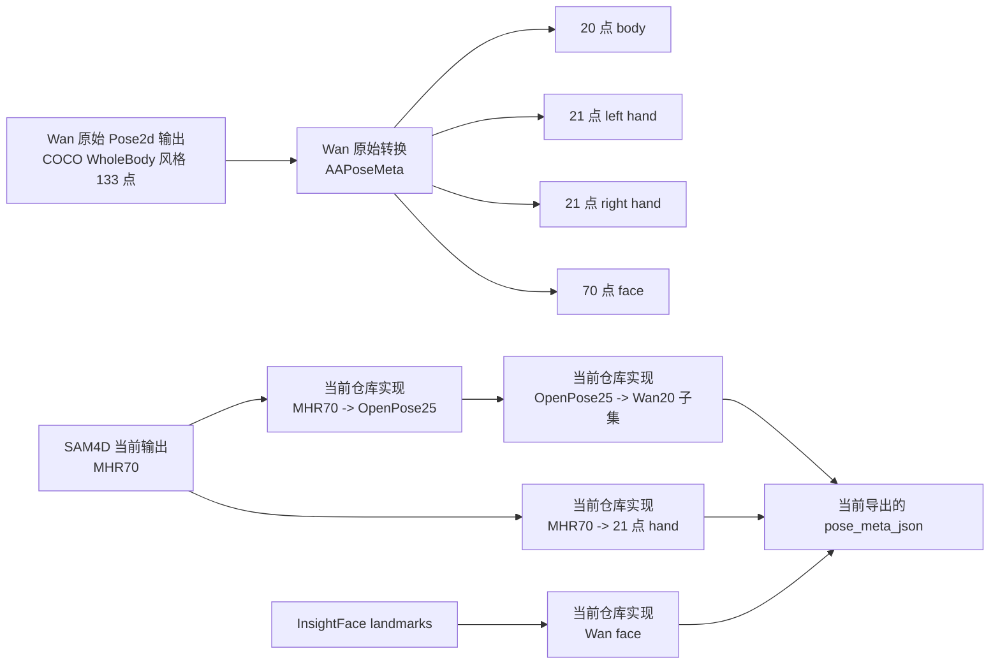
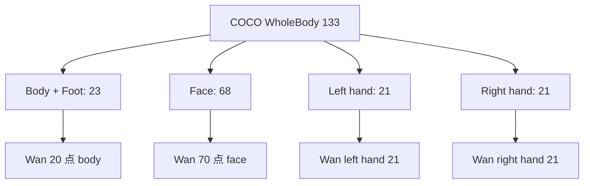

# SAM4D / MHR70 / OpenPose25 / COCO WholeBody133 / WanAnimate AAPose 对照说明

## 目的

这份文档专门回答下面几个容易混淆的问题：

- `SAM4D` 当前导出的 `MHR70` 到底是什么格式
- `OpenPose25`、`COCO17`、`COCO WholeBody133` 各自的结构是什么
- `WanAnimate` 训练/预处理里真正消费的 pose 格式是什么
- 为什么当前仓库里采用了 `MHR70 -> OpenPose25 -> Wan20` 这条路径
- 这条路径和 `WanAnimate` 原始 `133 -> Wan20` 路径相比，哪里是严格对齐的，哪里只是近似对齐

文档会把“标准格式定义”和“本仓库当前实现”明确分开描述。

## 一句话结论

### 结论 1

`WanAnimate` 不是直接吃“标准 WholeBody133 渲染图”，而是先把 `133` 点输入转成一套自己的 `AAPoseMeta` 表示：

- `20` 点 body
- `21` 点 left hand
- `21` 点 right hand
- `70` 点 face

### 结论 2

本仓库当前 `Wan` 导出实现不是直接从 `MHR70` 语义映射到 `Wan20`，而是走了一个中间层：

- `MHR70 -> OpenPose25 -> Wan20 子集`

这是一条“工程上先跑通”的路径，不是最严格的 `WanAnimate` 原始对齐路径。

### 结论 3

如果目标是最大限度贴近 `WanAnimate` 原始数据分布，更理想的方向不是继续依赖 `OpenPose25`，而是：

- `MHR70 -> 直接映射 Wan20 body`
- `MHR70 -> 直接映射 Wan hand`
- `face` 另行明确采用哪一种语义和点数

## 总览图



## 各格式的层级关系



## 格式速查表

| 名称 | 点数 | 是否标准 | 坐标表达 | 主要用途 | 本仓库中的角色 |
|---|---:|---|---|---|---|
| `MHR70` | 70 | 否，模型私有格式 | 像素坐标 + 模型输出 | `SAM4D / SAM-3D-Body` 内部人体参数输出 | 当前 `SAM4D` 的原始 2D/3D keypoints 来源 |
| `OpenPose25` | 25 | 是，OpenPose 体系 | 通常是像素坐标 + 置信度 | 单人/多人姿态、可视化、兼容导出 | 当前仓库用作 `MHR70` 的一个中间适配层 |
| `COCO17` | 17 | 是，COCO body | 像素或归一化坐标 | 通用 body benchmark | 当前仓库支持导出，但不足以表达手/脸 |
| `COCO WholeBody133` | 133 | 是，COCO WholeBody | 像素或归一化坐标 | body + foot + hand + face 全身关键点 | `WanAnimate` 原始 `Pose2d` 更接近这套输入 |
| `WanAnimate AAPoseMeta` | body 20 + hand 21+21 + face 70 | 否，Wan 自定义中间格式 | 归一化元数据，渲染时乘以宽高 | `WanAnimate` 的 `src_pose.mp4` / retarget 输入 | 我们当前要对齐的目标格式 |

## 1. MHR70 是什么

### 1.1 定义来源

本仓库里 `MHR70` 到 `OpenPose` 的映射定义来自：

- [models/sam_3d_body/sam_3d_body/metadata/__init__.py](/E:/Project/sam-body4d-master/.worktrees/sam4d-wananimate-export/models/sam_3d_body/sam_3d_body/metadata/__init__.py)

其中有：

- `MHR70_TO_OPENPOSE`
- `MHR70_PERMUTATION`

这说明 `MHR70` 是 `SAM-3D-Body` / `HMR` 系列内部使用的一套 `70` 点表示，不是标准 `COCO WholeBody133`。

### 1.2 从当前仓库代码能看出的结构

虽然这里没有单独的“70 点名称表”，但从当前代码可以推断它至少包含：

- body / foot 一部分点
- `21` 点右手
- `21` 点左手
- 少量头部/脸部相关点

手部索引定义在：

- [scripts/pose_json_export.py](/E:/Project/sam-body4d-master/.worktrees/sam4d-wananimate-export/scripts/pose_json_export.py)

其中：

- `RIGHT_HAND_MHR70` 是 `21` 个索引
- `LEFT_HAND_MHR70` 是 `21` 个索引

这已经占掉 `42` 个点。

再结合：

- `LEFT_FOOT_MHR70 = [15, 16, 17]`
- `RIGHT_FOOT_MHR70 = [18, 19, 20]`

可以看出 `MHR70` 确实是一套“body + foot + hands + 少量 head/face”的混合表示。

### 1.3 MHR70 不是 WholeBody133

这一点很重要。

`MHR70` 不是：

- `COCO17`
- `COCO WholeBody133`
- `OpenPose25`

它只是当前 `SAM4D` 模型原生输出的关键点空间。

因此任何导出到其他格式的过程，本质上都是“语义映射”，不是简单重命名。

## 2. OpenPose25 是什么

### 2.1 结构

`OpenPose25` 是 OpenPose 体系里常见的 `25` 点 body 格式，通常包括：

- nose
- neck
- shoulder / elbow / wrist
- hip / knee / ankle
- eye / ear
- foot/toe/heel 扩展点

本仓库使用的 `OpenPose25` 对应映射定义在：

- [scripts/openpose_export.py](/E:/Project/sam-body4d-master/.worktrees/sam4d-wananimate-export/scripts/openpose_export.py)
- [models/sam_3d_body/sam_3d_body/metadata/__init__.py](/E:/Project/sam-body4d-master/.worktrees/sam4d-wananimate-export/models/sam_3d_body/sam_3d_body/metadata/__init__.py)

### 2.2 当前仓库是如何得到 OpenPose25 的

当前实现会先走：

- `MHR70 -> OpenPose25`

见：

- [scripts/openpose_export.py](/E:/Project/sam-body4d-master/.worktrees/sam4d-wananimate-export/scripts/openpose_export.py)

核心逻辑是：

1. 用 `MHR70_TO_OPENPOSE` 把已有的 `MHR70` 点投到 OpenPose25 对应槽位
2. 对缺失槽位保持 `0`
3. 对 `midhip` 做一次额外合成

### 2.3 OpenPose25 在这个项目里的意义

它在当前仓库里更像一个“中间兼容层”：

- 一方面现有仓库已经有成熟的 `OpenPose` 导出逻辑
- 另一方面 `OpenPose25` 的 body 结构与 `Wan20 body` 有较多重合

所以它被用作：

- 先从 `MHR70` 获得一个相对稳定的 body 语义
- 再从中抽取 `Wan` 需要的 body 点

### 2.4 OpenPose25 的局限

对 `WanAnimate` 而言，`OpenPose25` 不是天然的最终目标格式。

问题主要有两个：

1. `Wan20` 不是 `OpenPose25` 的官方标准子集
2. `Wan20` 里有些点的定义更接近“几何合成点”，不是简单取某一个 `OpenPose` 原生点

## 3. COCO17 是什么

### 3.1 结构

`COCO17` 是最经典的 body-only 关键点格式。

通常只包含 `17` 个 body 点，例如：

- nose
- eyes
- ears
- shoulders
- elbows
- wrists
- hips
- knees
- ankles

### 3.2 优点

- 简洁
- benchmark 多
- 适合 body-only 任务

### 3.3 局限

对 `WanAnimate` 这类任务来说，`COCO17` 明显不够，因为它没有：

- hands
- face
- 更细的 foot 表示

因此：

- `COCO17` 适合做通用导出
- 不适合直接当作 `WanAnimate` 的完整 pose 输入语义

## 4. COCO WholeBody133 是什么

### 4.1 结构

`COCO WholeBody133` 是全身关键点标准，一般拆成：

- body + foot: `23`
- face: `68`
- left hand: `21`
- right hand: `21`

总数：

- `23 + 68 + 21 + 21 = 133`

### 4.2 WanAnimate 和 WholeBody133 的关系

`WanAnimate` 原始 `Pose2d` 流程虽然最终不是直接使用 `133` 点 body 来渲染，但它的输入来源非常接近这套结构。

证据在：

- [pose2d_utils.py](/G:/Project/WanAnimateDataProcess/wan/modules/animate/preprocess/pose2d_utils.py#L170)

这里：

- `kps_body` 从 `133` 点中抽/合成为 `20` 点 body
- `kps_lhand = kp2ds[91:112]`
- `kps_rhand = kp2ds[112:133]`
- `kps_face = concat(kp2ds[23:23+68], kp2ds[1:3])`

因此，`WanAnimate` 原始路径并不是：

- “直接使用 WholeBody133 可视化”

而是：

- “以 WholeBody133 风格输出为原料，构造出自己的 `AAPoseMeta`”

## 5. WanAnimate 的 AAPoseMeta 到底是什么

### 5.1 结构

`WanAnimate` 真实消费的不是标准 `OpenPose JSON`，也不是标准 `COCO WholeBody JSON`，而是类似下面这种 meta：

- `width`
- `height`
- `keypoints_body`
- `keypoints_left_hand`
- `keypoints_right_hand`
- `keypoints_face`

见：

- [pose2d_utils.py](/G:/Project/WanAnimateDataProcess/wan/modules/animate/preprocess/pose2d_utils.py#L128)

### 5.2 坐标表达方式

它的 `from_humanapi_meta()` 逻辑说明：

- `meta["keypoints_body"][:, :2]` 是归一化坐标
- 用时再乘 `(width, height)` 转成像素

也就是说，`WanAnimate` 的 pose meta 不是“原始像素坐标 JSON”，而是：

- 带 `width/height`
- 存归一化点位
- 渲染时恢复到像素

### 5.3 Wan body 不是 17 点，也不是 25 点

`WanAnimate` 里真正画骨架的 body 是 `20` 点，不是：

- `COCO17`
- `OpenPose25`

这个 `20` 点 body 更像一套“为可视化和 retarget 专门设计的 body 骨架”。

## 6. Wan 原始 `133 -> Wan20` 的真实映射

`WanAnimate` 原始 body 构造逻辑在：

- [pose2d_utils.py](/G:/Project/WanAnimateDataProcess/wan/modules/animate/preprocess/pose2d_utils.py#L170)

代码是：

```python
kps_body = (
    kp2ds[[0, 6, 6, 8, 10, 5, 7, 9, 12, 14, 16, 11, 13, 15, 2, 1, 4, 3, 17, 20]]
    + kp2ds[[0, 5, 6, 8, 10, 5, 7, 9, 12, 14, 16, 11, 13, 15, 2, 1, 4, 3, 18, 21]]
) / 2
```

可以展开成下面这张表。

## 7. Wan20 body 的语义表

| Wan20 索引 | Wan 原始来源 | 语义 | 当前仓库 `OpenPose25` 子集来源 | 是否严格等价 |
|---:|---|---|---|---|
| 0 | `avg(0, 0)` | nose | `OpenPose25[0]` | 是 |
| 1 | `avg(6, 5)` | 双肩中心，近似 neck | `OpenPose25[1]` neck | 近似，不严格 |
| 2 | `avg(6, 6)` | right shoulder | `OpenPose25[2]` | 是 |
| 3 | `avg(8, 8)` | right elbow | `OpenPose25[3]` | 是 |
| 4 | `avg(10, 10)` | right wrist | `OpenPose25[4]` | 是 |
| 5 | `avg(5, 5)` | left shoulder | `OpenPose25[5]` | 是 |
| 6 | `avg(7, 7)` | left elbow | `OpenPose25[6]` | 是 |
| 7 | `avg(9, 9)` | left wrist | `OpenPose25[7]` | 是 |
| 8 | `avg(12, 12)` | right hip | `OpenPose25[9]` | 是 |
| 9 | `avg(14, 14)` | right knee | `OpenPose25[10]` | 是 |
| 10 | `avg(16, 16)` | right ankle | `OpenPose25[11]` | 是 |
| 11 | `avg(11, 11)` | left hip | `OpenPose25[12]` | 是 |
| 12 | `avg(13, 13)` | left knee | `OpenPose25[13]` | 是 |
| 13 | `avg(15, 15)` | left ankle | `OpenPose25[14]` | 是 |
| 14 | `avg(2, 2)` | right eye | `OpenPose25[15]` | 是 |
| 15 | `avg(1, 1)` | left eye | `OpenPose25[16]` | 是 |
| 16 | `avg(4, 4)` | right ear | `OpenPose25[17]` | 是 |
| 17 | `avg(3, 3)` | left ear | `OpenPose25[18]` | 是 |
| 18 | `avg(17, 18)` | left toe center | `OpenPose25[19]` left big toe | 否 |
| 19 | `avg(20, 21)` | right toe center | `OpenPose25[22]` right big toe | 否 |

### 7.1 当前仓库最关键的两个不严格点

#### 不严格点 1：第 1 个 body 点

`WanAnimate` 原始定义是：

- 左肩、右肩的中心

当前仓库用的是：

- `OpenPose neck`

这两个通常很接近，但不是完全同义。

#### 不严格点 2：最后两个脚点

`WanAnimate` 原始定义是：

- 左脚前缘中心 = `avg(left_big_toe, left_small_toe)`
- 右脚前缘中心 = `avg(right_big_toe, right_small_toe)`

当前仓库用的是：

- 左大脚趾
- 右大脚趾

这会带来明显的脚部语义偏差。

## 8. 当前仓库为什么会采用 `OpenPose25` 作为中间层

当前 `Wan` 适配器在：

- [scripts/wan_pose_adapter.py](/E:/Project/sam-body4d-master/.worktrees/sam4d-wananimate-export/scripts/wan_pose_adapter.py)

代码路径是：

1. `convert_mhr70_to_openpose_arrays(...)`
2. `openpose_2d[WAN_BODY_FROM_OPENPOSE25]`

原因主要是工程上的：

- 仓库里已经有可用的 `MHR70 -> OpenPose25` 映射
- 这条路径能快速获得一个稳定的 body 骨架
- 大部分 `Wan20 body` 点与 `OpenPose25` 语义一致

所以这是一个：

- 先复用已有导出能力
- 先把 `Wan` 导出链跑通

的方案。

### 8.1 这条路径的优点

- 代码复用强
- 容易调试
- 大多数上半身 / 主干 body 点已经足够接近

### 8.2 这条路径的缺点

- 它不是 `WanAnimate` 原始对齐路径
- 脚部点不严格
- neck/shoulder-center 存在轻微语义偏差
- face 根本不是同一套定义

## 9. face 是当前差异最大的地方

### 9.1 WanAnimate 原始 face

`WanAnimate` 原始 face 构造在：

- [pose2d_utils.py](/G:/Project/WanAnimateDataProcess/wan/modules/animate/preprocess/pose2d_utils.py#L170)

它会构造：

- `68` 个 face 点
- 再拼接 `2` 个额外点

总共：

- `70` 点 face

### 9.2 当前仓库的 face

当前仓库 `Wan` 导出里，face 来自：

- [scripts/wan_face_export.py](/E:/Project/sam-body4d-master/.worktrees/sam4d-wananimate-export/scripts/wan_face_export.py)

它把 `InsightFace` 检测到的 landmarks 直接塞进：

- `keypoints_face`

这意味着当前 face 不是 `WanAnimate` 原始那套 `70` 点 face 语义，而是：

- `InsightFace` 检测器返回的 face landmarks

### 9.3 这会带来什么后果

字段结构层面：

- `keypoints_face` 这个键是兼容的

语义层面：

- 点数不同
- 点位定义不同
- 绘制风格不同

所以它不是严格意义上的 `Wan` face。

## 10. hand 部分的情况

当前 hand 直接使用：

- [scripts/pose_json_export.py](/E:/Project/sam-body4d-master/.worktrees/sam4d-wananimate-export/scripts/pose_json_export.py)

中的：

- `LEFT_HAND_MHR70`
- `RIGHT_HAND_MHR70`

也就是说，当前 hand 不是经 `OpenPose25` 中转，而是：

- 直接从 `MHR70` 中取 `21` 个手部点

这一点反而比 body 更直接。

但需要注意：

- “点数相同”不等于“语义一定严格同序”
- 如果要做到严格 `Wan` 对齐，仍然应当单独核对 `21` 个手部点的顺序和定义

## 11. 当前 `src_pose.mp4` 也不是 WanAnimate 原版画法

当前仓库的 pose 渲染在：

- [scripts/wan_pose_renderer.py](/E:/Project/sam-body4d-master/.worktrees/sam4d-wananimate-export/scripts/wan_pose_renderer.py)

它目前：

- 画 body
- 画 hands
- 不画 face
- 使用的是本地简化版颜色和骨架边

而 `WanAnimate` 原始渲染是：

- [human_visualization.py](/G:/Project/WanAnimateDataProcess/wan/modules/animate/preprocess/human_visualization.py)
- `draw_aapose_by_meta_new(...)`

所以：

- 当前 `pose_meta_json` 是“尝试贴近 Wan 的 meta”
- 当前 `src_pose.mp4` 只是“近似 Wan 风格的简化渲染”

不能把它理解成完全等价于 `WanAnimate` 原始 `src_pose.mp4`

## 12. 当前实现的真实状态总结

### 12.1 哪些部分已经比较对齐

- `Wan20 body` 的大部分主干点
- `21 + 21` hand 的点数结构
- `width / height / normalized xyc` 这一类 meta 外壳结构

### 12.2 哪些部分仍然不严格

- body 的 neck / toe-center 语义
- face 的点数和来源
- `src_pose.mp4` 的渲染样式

### 12.3 所以应该如何评价当前实现

最准确的说法是：

- 当前实现是“**Wan 风格 meta 的近似版本**”
- 不是“与 WanAnimate 原始 pose 完全同构的版本”

## 13. 推荐的后续演进路线

如果目标是最大限度贴近 `WanAnimate` 原始数据分布，建议按下面的顺序迭代。

### 路线 A：去掉 `OpenPose25` 中间层

直接改成：

- `MHR70 -> Wan20 body`

具体做法：

1. 明确 `Wan20` 每个点的语义
2. 为每个点单独写 `MHR70 -> Wan20` 映射规则
3. 对需要合成的点直接做平均，例如：
   - shoulder center
   - toe center

### 路线 B：明确 hand 顺序是否严格一致

对 `LEFT_HAND_MHR70 / RIGHT_HAND_MHR70` 与 `Wan` 的 `21` 点 hand 顺序做逐点核对。

### 路线 C：单独定义 face 策略

这一步需要明确目标：

1. 如果追求“先可用”，可以继续保留 `InsightFace` landmarks
2. 如果追求“严格贴近 Wan”，就要补成 `Wan` 的 `70` 点 face 语义

### 路线 D：替换 pose renderer

将当前简化版：

- [scripts/wan_pose_renderer.py](/E:/Project/sam-body4d-master/.worktrees/sam4d-wananimate-export/scripts/wan_pose_renderer.py)

逐步对齐到：

- `WanAnimate` 的 `draw_aapose_by_meta_new`

## 14. 对当前项目最重要的工程建议

### 如果你的目标是“先跑通数据制作”

可以接受当前思路，但要明确：

- 这是近似 `Wan`，不是严格 `Wan`

### 如果你的目标是“做高一致性训练数据”

优先级建议是：

1. 修 `body`：从 `OpenPose25` 子集改成直接 `MHR70 -> Wan20`
2. 修 `renderer`：对齐 `Wan` 原始 `src_pose.mp4` 风格
3. 修 `face`：决定是否补成 `70` 点语义

## 15. 最后一句话

你现在的直觉是对的：

- `WanAnimate` 确实是从 `133` 点 WholeBody 风格输入里“再变成自己的 20 点 body”
- 当前仓库直接使用 `OpenPose25` 作为中间层，虽然工程上方便，但从语义上并不是最严谨的长期方案

如果后续目标是“尽可能贴近 WanAnimate 原始 pose 分布”，下一步最值得做的事情就是：

- 把 `wan_pose_adapter.py` 从 `MHR70 -> OpenPose25 -> Wan20`
- 改成 `MHR70 -> 直接 Wan20`

